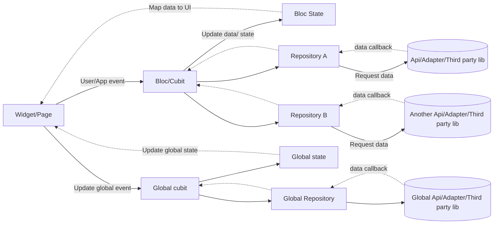

# Flutter Architecture

<p align="center">
Flutter repository follow BLOC Architecture and Common library
</p>
<p align="center">

</p>

## Getting Started

- Build and run on dev environment just type this on terminal

```sh
cd PATH/TO/YOUR/PROJECT 

flutter pub get

flutter run --dart-define="ENV=dev|staging|production" --flavor dev|pro
```

## Architecture Flow

Diagram below is a common flow of Bloc Architecture



## Features

- Follow [Bloc](https://pub.dev/packages/flutter_bloc) architecture with Cubit
- Use [freezed](https://pub.dev/packages/freezed)
  and [build_runner](https://pub.dev/packages/build_runner) for create Models and Bloc States
- Use [go_router](https://pub.dev/packages/go_router) for navigation
- Use [dio](https://pub.dev/packages/dio)[retrofit](https://pub.dev/packages/retrofit) for api
  client

## Done

- [x] Building CI/CD with GitHub Action
- [x] Support calling function with WebRTC and WebSocket
- [x] Add email filter example

## WIP

- [ ] Refactor code style
- [ ] Config deeplink and redirect

## FUTURE

- [ ] Add local cache for UX improvement
- [ ] Support notification
- [ ] Performance -->>>
- [ ] Stream flow explain

## Licences

Updating...